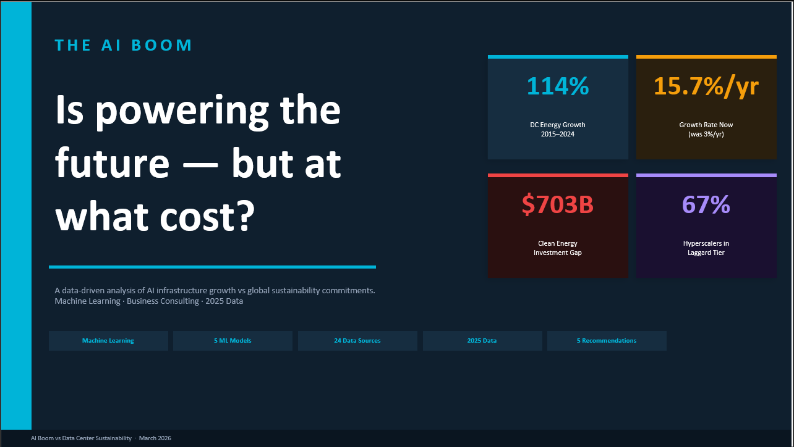
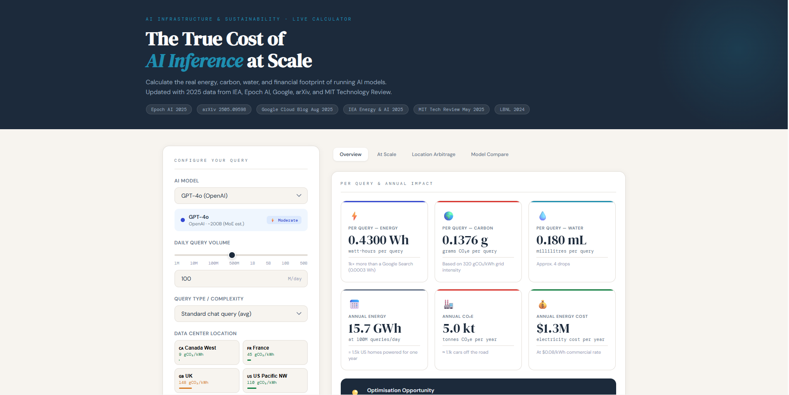
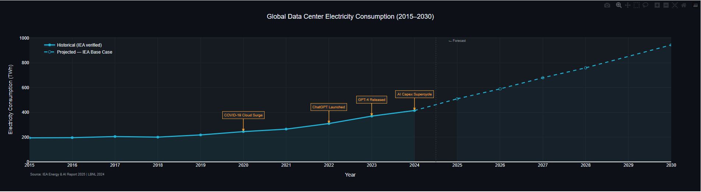
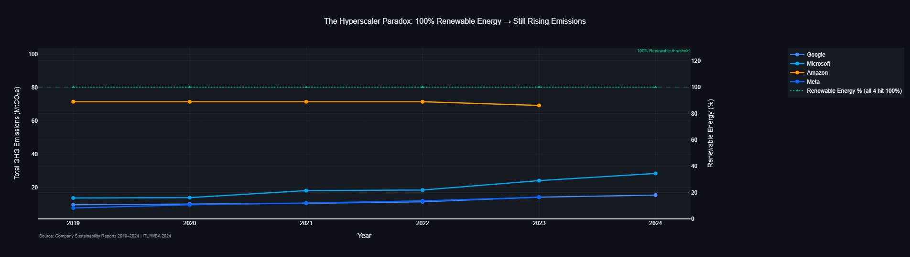

# AI Boom vs Data Center Sustainability



> **Can the AI industry build the infrastructure of the future without destroying the climate commitments that are supposed to protect it?**
> This project answers that question with data, machine learning, and a quantified business consulting framework.

---

## The Finding in Three Lines

- Global DC energy grew **114%** from 2015–2024, now accelerating at **15.7%/yr** — five times the pre-AI rate
- All four major hyperscalers claim **100% renewable energy** yet their combined emissions rose **50%+** since 2020
- A **$703B** clean energy investment gap must be closed by 2030. A **70×** carbon arbitrage opportunity exists today, untapped

---

## Live Dashboard

**[→ Open the AI Inference Emissions Calculator](https://YOUR-USERNAME.github.io/ai_sustainability_project/dashboard/AI_Inference_Calculator.html)**

Calculate the real energy, carbon, water, and financial footprint of running any AI model at scale.
Covers 16 models across 8 global grid regions — updated with 2025 data.



---

## Project Structure
```
ai_sustainability_project/
├── data/                  # Two Excel workbooks — 19 curated, source-cited datasets
├── notebooks/             # Six Jupyter notebooks (EDA → ML → Business outputs)
├── outputs/
│   ├── charts/            # 21 interactive Plotly HTML charts
│   └── models/            # Saved regression model + scaler (.pkl)
├── dashboard/             # Standalone HTML inference emissions calculator
└── deliverables/          # Written report, 25-slide deck, 5-slide executive brief
```

---

## Three Acts, Three Findings

### Act I — The Boom



DC energy demand has grown from 194 TWh (2015) to 415 TWh (2024) and is projected to reach 945–1,200 TWh by 2030.
The polynomial growth model (R²=0.994) confirms the trajectory is accelerating, not linear.

A regression model (R²=0.866) across 11 AI boom KPIs quantifies the driver:
**every $1B in DC capital expenditure drives an additional 33.7 TWh of annual energy demand.**

### Act II — The Reckoning



All four major hyperscalers claim 100% renewable energy. All four show rising absolute GHG emissions.
K-Means clustering (k=3, silhouette=0.456) across five sustainability dimensions reveals:

- **67%** of company-year observations fall in the Laggard tier
- All four companies converged to a **2/5 sustainability score** by 2024 regardless of starting position
- This convergence is systemic — not company-specific


### Act III — The Decision Point

A **$703B** cumulative clean energy investment shortfall exists for 2025–2030.
A **70×** carbon intensity difference between the cleanest (Canada West, 9 gCO₂/kWh) and dirtiest
(India, 630 gCO₂/kWh) DC regions represents an untapped carbon arbitrage opportunity.
Running ChatGPT inference from France rather than a US average grid saves **36,800 tonnes CO₂e/year** — equivalent to
removing 8,000 cars from the road at zero additional cost.

---

## Machine Learning Methods

| Technique | Purpose | Key Result |
|-----------|---------|-----------|
| Linear Regression | Quantify AI-energy relationship | R²=0.866, RMSE=15.8 TWh on 2022–24 test set |
| Time Series Forecasting | DC energy to 2030 | Polynomial R²=0.994, calibrated to IEA scenarios |
| K-Means Clustering | Rank hyperscaler sustainability | k=3 validated (silhouette=0.456), 67% Laggard |
| PCA | Visualise sustainability profiles | 74.9% variance in 2 components |
| Feature Correlation | Validate ML inputs | All 11 AI KPIs correlate >0.86 with DC energy |

> **Note on model selection:** XGBoost and Random Forest both achieved R²=−8.65 on the test set due to n=10 annual observations — exactly what small-sample ML literature predicts. Linear Regression was selected empirically after comparing all four candidates using time-series cross-validation.

---

## Notebooks

| Notebook | Contents |
|----------|----------|
| `01_setup_and_loading` | Data audit, completeness analysis, Finding 1: 68% of models have no disclosed energy |
| `02_eda` | 7 interactive Plotly charts — DC energy hero, AI investment overlay, compute scaling law, inference energy, hyperscaler paradox, sustainability gap, correlation heatmap |
| `03_regression` | Linear regression model, feature importance, coefficient analysis |
| `04_forecasting` | Polynomial/exponential growth models, 2030 Base Case and Accelerated scenarios |
| `05_clustering` | K-Means, PCA, tier movement 2019–2024, sustainability score decline, radar profiles |
| `06_business_outputs` | Inference calculator, location arbitrage, $703B investment gap, executive scorecard, recommendations framework |

---

## Five Strategic Recommendations

| # | Recommendation | Audience | Impact |
|---|---------------|----------|--------|
| 01 | Mandate 24/7 Carbon-Free Energy | Regulators | Exposes 20–40%pt hidden gap vs certificate claims |
| 02 | Carbon-Aware DC Location Policy | DC Operators | 70× arbitrage — 621 kt CO₂e saved per TWh |
| 03 | Require Inference Energy Disclosure | AI Companies | 40–60% reduction through model selection |
| 04 | Close the $703B Clean Energy Gap | Investors | Prevents 200+ MtCO₂e avoidable by 2030 |
| 05 | Mandate Scope 3 Disclosure | Boards / Regulators | Exposes footprint 3–5× larger than Scope 1+2 |

---

## Deliverables

| Deliverable | Description |
|-------------|-------------|
| [5-Slide Executive Brief](deliverables/AI_Boom_ExecutiveBriefing_5slides.pptx) | The full story in under 3 minutes |
| [25-Slide Full Presentation](deliverables/AI_Boom_vs_DC_Sustainability.pptx) | Complete consulting deck — three acts, 17 exhibits |
| [Written Report](deliverables/AI_Boom_vs_DC_Sustainability_Report.docx) | 35-page structured report with methodology, findings, appendix |
| [Live Dashboard](https://YOUR-USERNAME.github.io/ai_sustainability_project/dashboard/AI_Inference_Calculator.html) | Interactive calculator — 16 models, 8 grid regions |

---

## Data Sources

IEA Energy & AI Report 2025 · Stanford HAI AI Index 2025 · Uptime Institute 2024 · 
Google / Microsoft / Amazon / Meta Sustainability Reports · Epoch AI 2025 · 
arXiv 2505.09598 · Synergy Research Group · Electricity Maps · ITU/WBA 2024 · 
Carbone4 2024 · JLL DC Outlook 2026 · LBNL 2024

---

## Setup
```bash
git clone https://github.com/YOUR-USERNAME/ai_sustainability_project.git
cd ai_sustainability_project
pip install -r requirements.txt
jupyter notebook
```

Open notebooks in order: `01_` through `06_`.
The dashboard requires no installation — open `dashboard/AI_Inference_Calculator.html` directly in any browser.

---

*March 2026 · Data Science & Business Consulting*
